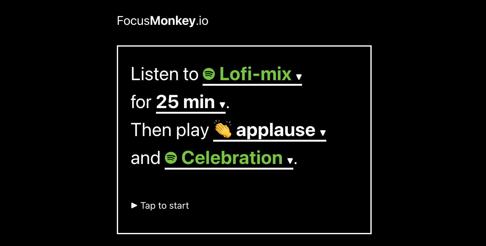
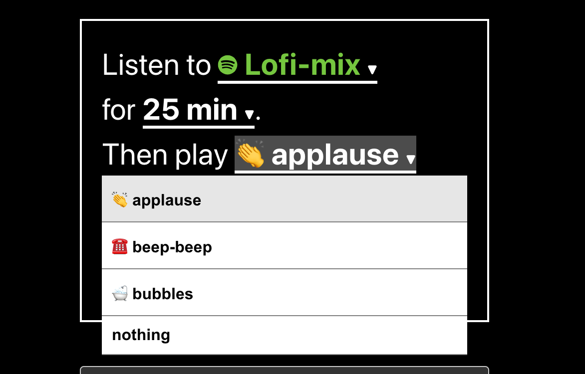

When working it is important to stay focused.

Pomodoro timers are good ways to discipline yourself to work well.

[FocusMonkey](/) is the best pomodoro timer you can find, because it connects to your Spotify.

## 1. Choose a playlist to work with

First, choose a playlist you want to listen to while working.

## 2. Choose an alert sound

Then choose an alert sound. It can be applause, beep-beep, bubbles or nothing.

## 3. Choose a song to relax with

After your focus session is done, the other song will start playing.

Choose a nice song to shake off and celebrate your good session!

----

Check out the [focus timer for Spotify](https://focusmonkey.io/)!