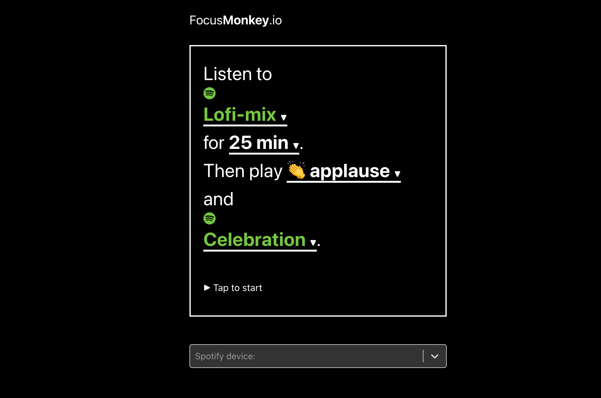

A study timer is a tool that let's you timebox your study sessions.

This is an awesome way to get into a deep, focused state.

## FocusMonkey as a study timer

The best way to study is by using [FocusMonkey](/). It is a timer with connection to Spotify included.

You can start the focus timer with a certain music in the background.

When the timer is done, you automatically hear another playlist. Genius!

Check out [FocusMonkey](/) today!